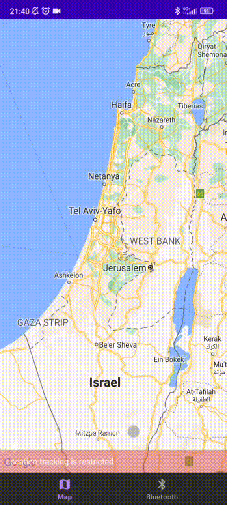
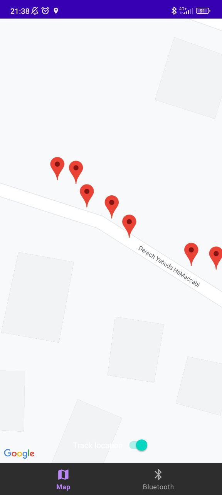
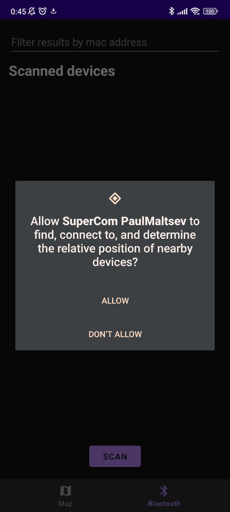
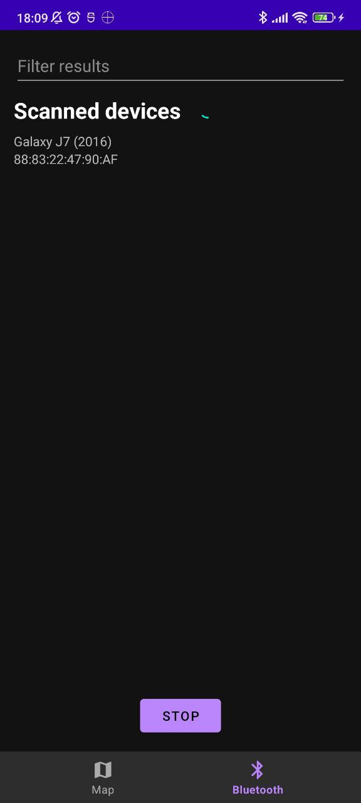

# SuperCom

#

### Stack
- Kotlin
- Google Map SDK
- Bluetooth
- Background service
- Navigation component
- ViewBinding
- LiveData
- Flow
- Room
- Notifications
- Coroutines

#

### Summary
Example application how you can use Google Map SDK and Bluetooth on Android devices.

The application makes use of the Google Map SDK to track the user's location.
The user can view their current location in real-time.
These locations are stored in local databases by the room library.
Allowing the user to access their location history in the future.

In addition the application uses Bluetooth hardware to scan for nearby devices.
This feature can be used to identify nearby Bluetooth-enabled devices such as smartwatches,
headphones, or speakers.

This can be particularly useful for users who are traveling or exploring new areas and want to
keep track of their location or find nearby points of interest.

#

 

### Location tracking in action ( GIF )   |   Location history
  

### Bluetooth permission   |   Scanned devices
   

